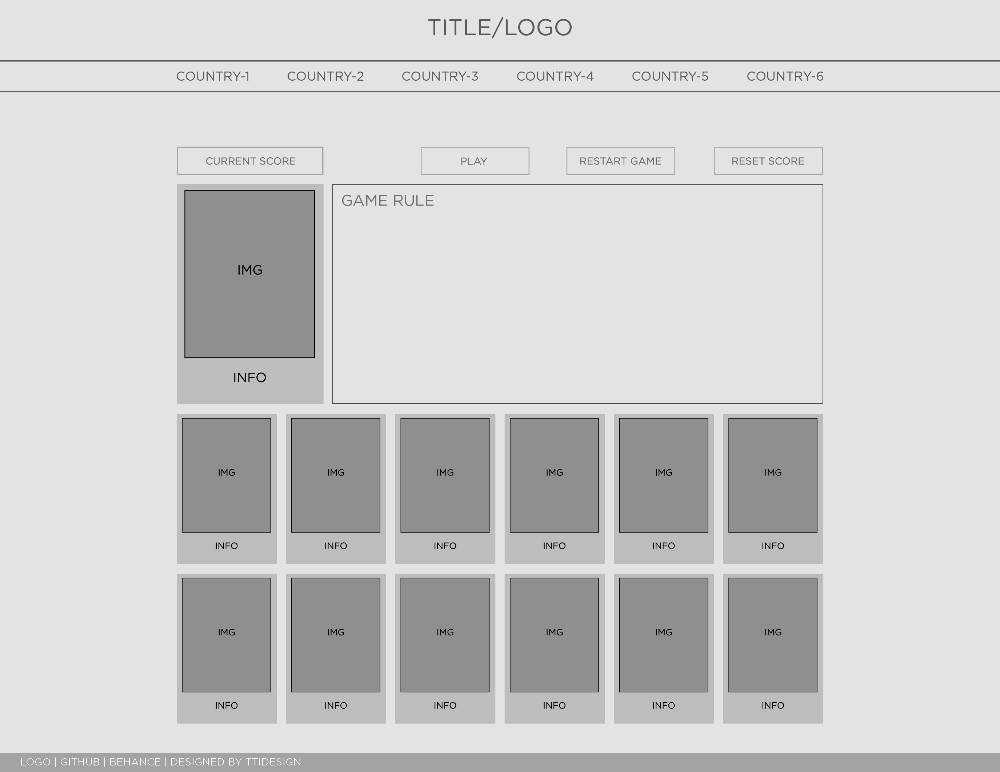

## About the Project

[Virtual Tour Flashcards](https://ttidesign.github.io/GA-Project-1/)
is a memorizing game where users will have few minutes to look at cards and their images. After few minutes, all the cards will be flipped down and the game will start.

## Virtual Tour Flashcards


## User Stories

During unprecedented time of Covid-19 pandemic, as much as I want to travel and explore more places. I as well as other people had to stay home. It's not just for ones health, but also for a virus-free community. For people who like to explore the world, visiting different places, learn about the culture and enjoying awesome sceneries and foods, this time is not easy going for them. For that reason, I created this virtual tour flashcard to help people enjoy their time at home playing the game, looking at pictures and learn more about the places this game will take them to. This game will show users most popular places that each countries have to offer. This game act as a recommendation for next travel spots. So when all of this is over, users can go out and explore the world again, perhaps to the places that this game bring them.

## Installation and Game Instructions

[The game](https://ttidesign.github.io/GA-Project-1/)
should be playable on any browser. Start game by click "Let's Play' button.

The goal of the game is to flip all the cards up with highest point possible (100pt). If the users flipped the correct matching pair, they will score 10 points. However, if they flip the wrong matching card, the point will be deducted by 1 point for every wrong click. If all the cards has been flipped, the game end and winning message will show up. The goal of the game is to test user's memory, but more importantly, it presents users something more interesting, information about beautiful places they can visit if they like. Each pair of cards contain image and information about tourist attractions places of various countries. By playing the game, users will get to learn more about the geography, culture and places to plan for their next vacation.

## Wireframing

I created a basic wireframe for the website using Adobe Indesign to plan ahead the over all look of the web. Followed this layout to keep my design and code easy to follow.


## Technology Used

HTML5 - semantic structure
CSS - grid, styling and micro interactions
Javascript - DOM manipulation, event listeners and event handlers, first class functions, call back functions, set timeout and logic to progress to winning the game and moving to next harder levels.
Git- Branches, save and commit changes to repo
GitHub- Updated from local repo and push to online repo
GitHub Pages- Hosting the game
Adobe CC- To create images and information on cards

In this game I first used Adobe Indesign to ideate the web structure using wire-framing technique. After I had the layout I then use Adobe Photoshop to create cards to create contents for the web. Then moving to use HTML5 and CSS to layout structure of the webpage. Utilized CSS grid to create a dynamic and user friendly webpage. A informative display of information and images for each places. Neutral color tone and easy to follow information allow users to navigate with ease. With Javascript I used DOM manipulation technique to dynamically adding cards to the grid every time users click play or restart game. Using event listeners and event handler to add interactions to almost any content of the webpage. Using function, call back function and set time out to add logic to the game to create more fun and challenging game. Below are some screen shot of the early stage wire-frame.

## Challenges and Overcome Obstacles

When first started this project I had a lot of ideas in mind and trying to accomplish them all. I gave myself a set goal for minimum viable product, then next goal and next goal as I advance through challenges. One of the biggest challenges is to switch my brain from a designer to a developer stand point and how I could later use my design skills to make the web page works better. Through out the process, adding game functions and logics are very challenging, one of the problem that I ran into is how to set a flip back function if the users flipped the incorrect card, using set-timeout function allowed me to flip the card back down after a brief moment. As I created image and div tags using vanilla javascript instead of hard-coded it in HTML, I find it more challenging to target the correct element to create event listeners and handlers. In my mind it should work but it's not because I was targeting the class versus the tag, the function worked on tag but not on class. Using console and reading material and resource, I was able to set up the event and function correctly. Next is how to add the logic to check the game state if it's still playing or if users already finished the game. How would my alert modal box showup and how users can progress to next level. I tend to think these actions and reactions in a chain instead of broken them down into smaller problems, and solve them one by one. My next goal is to create more content for webpage, adding more places to visits.

## Code Sample

One of the function that I'm proud of is to figure out how to set the timer for the card to flip back down if the card that was clicked is not matching with the previous card. Moreover, having this function run correctly is a next step to setup the function to check for game end.

```javascript
function checkIfMatch(userInput) {
	if (cardInPlay.length === 2) {
		if (cardInPlay[0] === cardInPlay[1]) {
			matchedCard.push(cardInPlay[0], cardInPlay[1]);
			cardInPlay = [];
			score += 10;
			scoreBoard.innerText = 'SCORE: ' + score;
		} else if (cardInPlay[0] !== cardInPlay[1]) {
			cardInPlay.pop();
			score -= 1;
			scoreBoard.innerText = 'SCORE: ' + score;
			setTimeout(function () {
				cardsBoard[userInput + 1].setAttribute('src', './images/card-back.png');
			}, 600);
		}
	}
}
```

## Try it yourself

The game is playable here [Virtual Tour Flashcards](https://ttidesign.github.io/GA-Project-1/)
